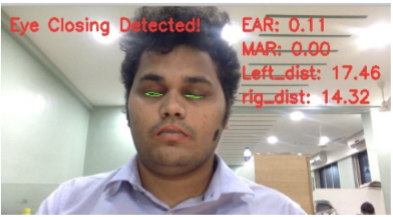

# UAMS (User Attentivenes Monitoring System)


&nbsp;&nbsp;&nbsp;&nbsp;&nbsp;&nbsp;To identify Persons behavior is one of the most challenging tasks. Behavior contains facial expression, hand gestures, body postures, etc. Out of that, we use facial expression to identify ones behavior. A facial expression contains information that can be utilized for levels of drowsiness. There are numerous facial highlights that can be extricated from the face to interpret the level of drowsiness. These incorporate eye blinks, yawning and head movements. Though, the development of a drowsiness detection system that produces reliable and precise results is a challenging task as it needs accurate and robust algorithms. A wide-ranging of techniques have been tested to detect user drowsiness earlier. The recent growth of deep learning needs that these algorithms be reexamined to evaluate their accuracy in detection of drowsiness. User Attentiveness Monitoring System (UAMS) detects the Users drowsiness based on behavioral measures using deep learning techniques. UAMS analyses each and every person in the crowd and Classify them into Attentive and Non-attentive using OpenCV and Dlib (Histogram of oriented gradients (HOG) and Support Vector Machine (SVM)) algorithm.

## Problem Definition
&nbsp;&nbsp;&nbsp;&nbsp;&nbsp;&nbsp;The flow of the proposed system is shown in Fig. 1, First UAMS picks video or image as the input file, resize it into 300x300 resolution and passes to the caffe model. Caffe model converts it into Blob which is a collection of binary data stored as a single entity and tries to identify face region and store it into face array and passes to the UAMS. UAMS passes this array to the Dlib. Dlib is a general purpose cross-platform software library written in the programming language C++ which contains HOG+ SVM. Using HOG+ SVM Dlib maps 68-face coordinates on extracted faces. With the help of this left and right eye, mouth region is identified. Using Euclidean distance formula, calculate eye aspect ratio (EAR), mouth aspect ratio (MAR) and passes to the threshold value, if EAR and MAR are more than the threshold value then the User is drowsy i.e. Unattentive.


<p align="center">
  
</p>

## Proposed System Architecture
### Step 1 Data Preparation

##### cv2.cvtColor()
&nbsp;&nbsp;&nbsp;&nbsp;&nbsp;&nbsp;There are more than 150 color-space conversion methods available in OpenCV. we use RGB to Gray conversion. Since RGB image takes 24 bits (8 x 3) while grayscale image takes only 8 bits to store and we are interested in developing a time-efficient system, therefore after capturing the image (RGB image) it is converted into a grayscale image. The intensity of an image is the average of the three color elements, so the grayscale image that represents the original color image can be converted as
##### cv2.dnn.blobFromImage() 
&nbsp;&nbsp;&nbsp;&nbsp;&nbsp;&nbsp;In this step, we use cv2.dnn.blobFromImage() to store the images. a blob is just a potentially collection of images with the same spatial dimensions (i.e., width and height), same depth (number of channels), that have all be preprocessed in the same manner.

blob = cv2.dnn.blobFromImage(image, scalefactor=1.0, size, mean, swapRB=True)

### Step 2 Model Definition
When using OpenCVs deep neural network module with Caffe models, well need two sets of files:

1.The .prototxt file(s) which define the model architecture (i.e., the layers themselves) of SSD framework based on ResNet Architecture. 

2.The .caffemodel file which contains the weights for the actual layers Both files are used to detect faces and these detected faces are store into face array. Extracted Faces are as follows:

### Step 3 Face Array 
Face Array We detect the faces using cv2.dnn.net.forward() which is the class of OpenCV module which gives location coordinates of the face region. These coordinates manipulate with np.array() which is a function of NumPy which stands for Numerical Python, is a library consisting of multidimensional array objects and a collection of routines for processing those faces. np.array() lies these point with the actual image. Then, obtained face array hand over to Dlib for further process.
<p align="center">
  &nbsp;&nbsp;&nbsp;&nbsp;&nbsp;&nbsp;
  &nbsp;&nbsp;&nbsp;&nbsp;&nbsp;&nbsp;
  &nbsp;&nbsp;&nbsp;&nbsp;&nbsp;&nbsp;
</p>

## Implementation (Result)
### Eye Aspect Ratio (EAR)

<p align="center">
&nbsp;&nbsp;&nbsp;&nbsp;&nbsp;&nbsp;
&nbsp;&nbsp;&nbsp;&nbsp;&nbsp;&nbsp;
</p>

### Mouth Aspect Ratio

<p align="center">
&nbsp;&nbsp;&nbsp;&nbsp;&nbsp;&nbsp;
&nbsp;&nbsp;&nbsp;&nbsp;&nbsp;&nbsp;
</p>


## Working Model
Here it is shown UAMS Works for more than 1 individuals as a Drowsiness Detection.
<p align="center">
&nbsp;&nbsp;&nbsp;&nbsp;&nbsp;&nbsp;

</p>


## Dependencies and Technology Stack

UAMS uses a number of open source projects to work properly:

* [OpenCV](https://opencv.org/) - Computer Vision Library for dnn support.
* [DLIB](http://dlib.net/) - For Facial Landmarks detection.
* [imutils](https://pypi.org/project/imutils/) - For other image related Operation.
* [numpy](https://numpy.org/) - For Conversion of images to text data or pixel values.
* [scipy](https://www.scipy.org/) - To do EAR and MAR Calculation's

## Installation

UAMS requires Python 3.6 or heigher to run properly.

Install the dependencies to start the project.

* scipy
`sudo pip install scipy`

* python-opencv
`sudo pip install python-opencv`

* imutils
`sudo pip install imutils`

* dlib
`sudo pip install dlib`

## Run 
```
git clone git@github.com:AkashMJain/UAMS.git
cd AttetionMonitoring
$./run.sh
```

## Licence

This project is licensed under the GNU General Public License v3.0 - see the LICENSE.md file for details
